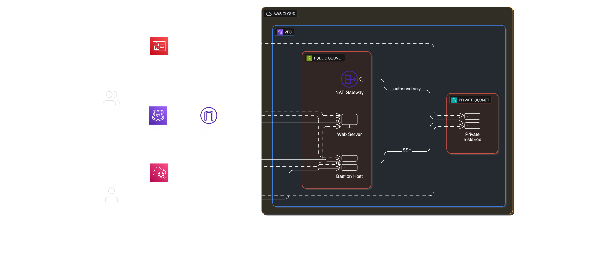
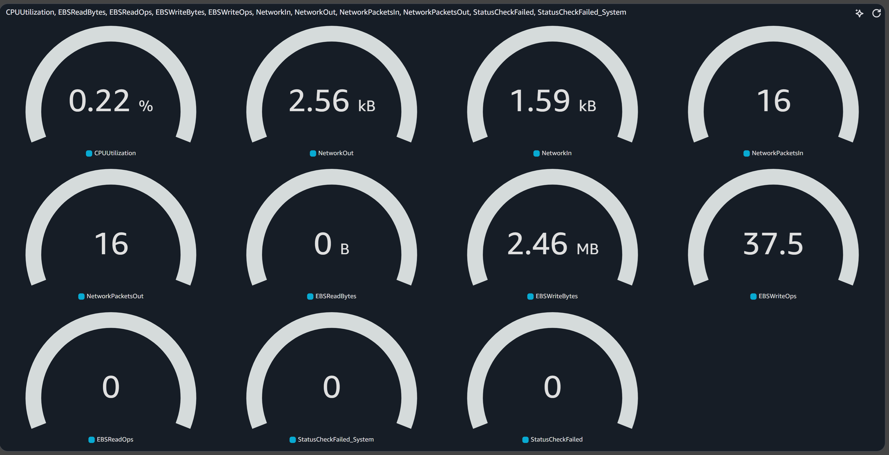
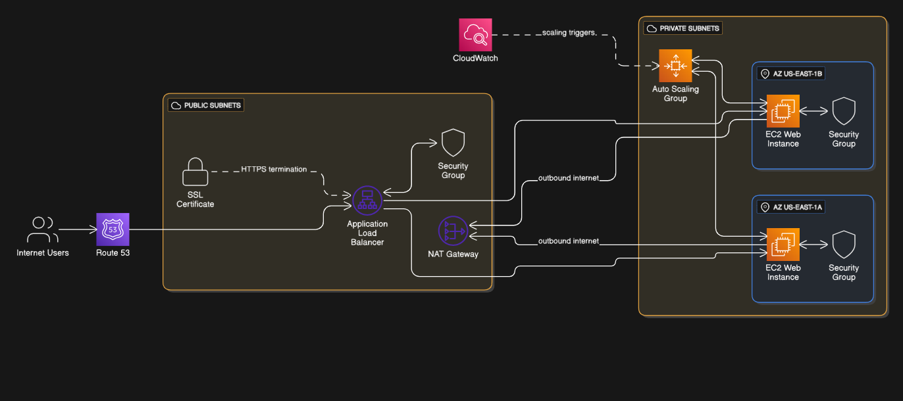
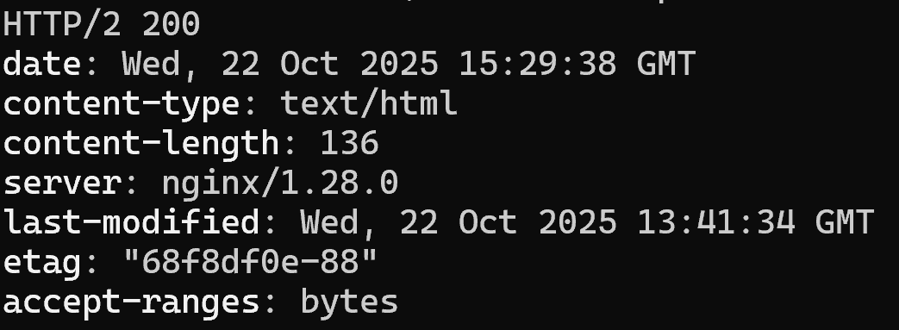

# AWS Networking Assignments – Comprehensive Report

## Overview

This repository contains two linked AWS networking assignments demonstrating multi-tier networking, monitoring, and load balancing within a Virtual Private Cloud (VPC).  
Both assignments were deployed using Amazon Linux 2023 instances and follow best practices for isolation, routing, and monitoring.

---

## Assignment 1 – VPC, Bastion, and Monitoring Setup

### Objective
Design and deploy a **secure AWS VPC** environment with:
- A public subnet hosting a public instance and bastion host  
- A private subnet hosting backend instances  
- Monitoring with CloudWatch and custom metrics  
- Domain management via Route 53  

### Architecture Diagram



### Architecture Components

| Component | Description |
|------------|-------------|
| **VPC** | Custom VPC with 2 Availability Zones for redundancy |
| **Subnets** | Public Subnets (10.0.1.0/24, 10.0.2.0/24), Private Subnets (10.0.11.0/24, 10.0.12.0/24) |
| **Internet Gateway** | Attached to VPC to allow outbound internet access |
| **NAT Gateway** | Deployed in public subnet to enable private instances' updates and package downloads |
| **Route Tables** | Public RT → IGW, Private RT → NAT GW |
| **EC2 Instances** | Bastion (SSH Access), Public Web, Private App |
| **CloudWatch** | Installed on all EC2 instances for metrics and logs |
| **Route 53** | Hosted zone managing custom DNS records |

### Security Groups

| SG | Description | Inbound | Outbound |
|----|--------------|----------|-----------|
| **sg-bastion** | SSH jump host | TCP 22 from 0.0.0.0/0 | All |
| **sg-public** | Web server | HTTP 80 from 0.0.0.0/0 | All |
| **sg-private** | App/backend instance | SSH 22 from sg-bastion / sg-public | All |

### Key Learnings
- The **bastion** is the only instance with SSH access from the internet.
- Private instances route outbound traffic through the **NAT Gateway** for package installs.
- CloudWatch Agent was used to push custom metrics and logs for all instances.

### Monitoring with CloudWatch

CloudWatch Agent is installed on **all EC2 instances** for real-time monitoring and performance tracking.

#### Metrics Tracked
- CPU Utilization  
- Memory Usage (% used)  
- Disk Usage (% used)  
- Disk I/O (Read/Write bytes)  
- Network In/Out  
- TCP Connections (Established)  
- Running Processes  
- Swap Usage  

#### CloudWatch Agent Configuration
```json
{
  "agent": { "metrics_collection_interval": 60 },
  "metrics": {
    "namespace": "CWAgent",
    "append_dimensions": { "InstanceId": "${aws:InstanceId}" },
    "metrics_collected": {
      "mem": { "measurement": ["used_percent"] },
      "cpu": { "measurement": ["usage_active"] },
      "disk": { "measurement": ["used_percent"] },
      "diskio": { "measurement": ["read_bytes", "write_bytes"] },
      "net": { "measurement": ["bytes_sent", "bytes_recv"] },
      "netstat": { "measurement": ["tcp_established"] },
      "processes": { "measurement": ["running"] },
      "swap": { "measurement": ["used_percent"] }
    }
  }
}
```



### Route 53 Configuration

| Record | Type | Target | Purpose |
|--------|------|---------|----------|
| **A Record** | Alias → Public EC2 / ALB | Root domain traffic | Web access |
| **CNAME** | `alb.alistechlab.click` → ALB DNS | Load Balancer access | ALB testing |
| **CNAME** | ACM validation record | SSL validation | HTTPS setup |

### Troubleshooting

* **Issue:** Private instances lacked internet access → resolved by ensuring proper NAT GW association.
* **Issue:** CloudWatch Agent failed to start → fixed by verifying IAM role permissions (`AmazonSSMManagedInstanceCore`, `CloudWatchAgentServerPolicy`).
* **Issue:** Route 53 A record pointed to a static EC2 IP instead of ALB → replaced with an Alias record.

---

## Assignment 2 – Application Load Balancer (ALB)

### Objective

Deploy an **Application Load Balancer** distributing traffic between two private EC2 instances.

### Architecture Diagram



### Architecture

| Component | Description |
|-----------|-------------|
| **VPC** | Same VPC as Assignment 1 |
| **Private Subnets** | `us-east-1a` and `us-east-1b` |
| **Public Subnet** | Hosts ALB |
| **Target Group** | Two EC2 instances running Nginx |
| **Load Balancer** | Application Load Balancer (ALB) listening on ports 80 and 443 |
| **Auto Scaling** | Maintains 2 instances (min 2, max 4) |

### EC2 User Data Script (AL2023)

```bash
#!/bin/bash
sudo dnf -y update
sudo dnf -y install nginx curl
INSTANCE_ID=$(curl -s http://169.254.169.254/latest/meta-data/instance-id)
AZ=$(curl -s http://169.254.169.254/latest/meta-data/placement/availability-zone)
echo "<html><body><h2>ALB Lab: Instance Page</h2><p>Instance ID: $INSTANCE_ID</p><p>Availability Zone: $AZ</p></body></html>" | sudo tee /usr/share/nginx/html/index.html
echo "ok" | sudo tee /usr/share/nginx/html/health
sudo systemctl enable nginx
sudo systemctl start nginx
```

### Security Groups

| SG | Inbound | Outbound |
|----|---------|----------|
| **sg-alb** | HTTP 80 / HTTPS 443 from 0.0.0.0/0 | All |
| **sg-web** | HTTP 80 from sg-alb only | All |

SSH was not opened to instances; bastion is used for shell access.

### ALB and Target Group Configuration

* **ALB Type:** Application Load Balancer
* **Listeners:** HTTP (80), HTTPS (443 – optional bonus)
* **Target Type:** Instance
* **Health Check:** Path `/health`, interval 30 s
* **Registered Targets:** 2 private EC2 instances

### Bonus – HTTPS Setup

1. Requested ACM certificate for `alistechlab.click`
2. Created CNAME record for validation in Route 53
3. Updated Route 53 root A record → Alias to ALB
4. Added HTTPS listener on port 443 using the issued certificate
5. Configured HTTP → HTTPS redirect on ALB

### Auto Scaling Setup

1. **Launch Template:** Based on the above AMI and User Data script
2. **Auto Scaling Group:**
   * VPC: Same VPC
   * Subnets: Private AZ-A and AZ-B
   * Target Group: Existing ALB target group
   * Health check: ELB
   * Desired = 2, Min = 2, Max = 4
3. **Scaling Policy:** Target tracking on CPU utilization (50%)

### Troubleshooting Log

* **Nginx not found:** Used `sudo dnf -y install nginx --allowerasing` to fix package conflicts.
* **Health checks failing:** Missing `/health` file and service not started — added explicit creation and `systemctl start nginx`.
* **No internet in private instances:** Ensured default route points to NAT Gateway.
* **Certificate pending validation:** Resolved by creating correct ACM CNAME record in Route 53.
* **HTTPS error:** Replaced A record (IP) with Alias to ALB.
* **Validation:**
  ```bash
  dig +short alistechlab.click
  curl -I https://alistechlab.click
  ```
  Returned `HTTP/2 200` confirming success.



### Final Verification

| Test | Command | Expected Result |
|------|---------|-----------------|
| Check DNS resolution | `dig +short alistechlab.click` | Multiple AWS ALB IPs |
| HTTP redirect | `curl -I http://alistechlab.click` | 301 Redirect to HTTPS |
| HTTPS access | `curl -I https://alistechlab.click` | HTTP/2 200 OK |
| ALB health | AWS Console → Target Group | All targets Healthy |
| Auto Scaling | Set desired = 3 | Third instance launches and becomes Healthy |

---

## Conclusion

Across both assignments, we built a secure, scalable, and monitored networking environment in AWS:

* VPC with segregated public and private subnets
* Bastion access model for security
* NAT gateway for egress from private instances
* CloudWatch for monitoring system health
* Route 53 for domain management and SSL validation
* ALB with HTTPS and Auto Scaling for high availability
